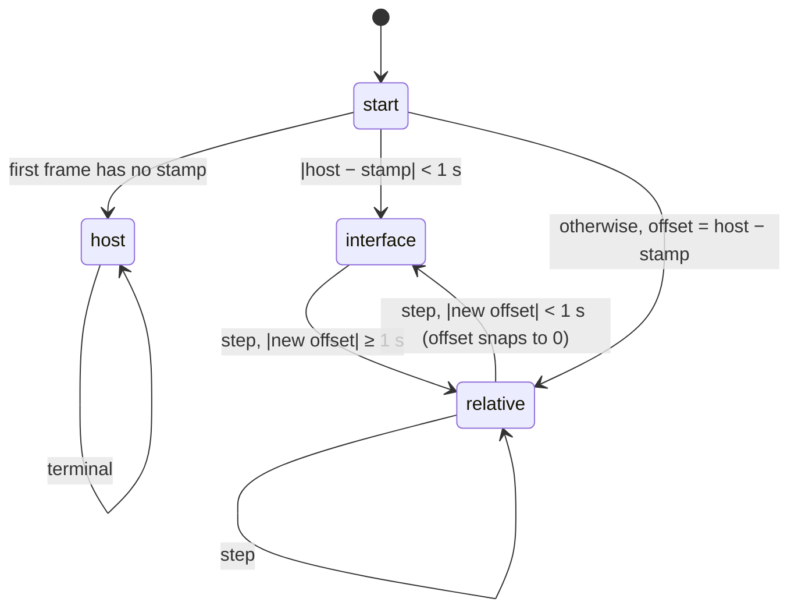

# Timestamps

Every frame arrives with a stamp from the *interface*: the kernel for
SocketCAN, the driver for PCAN/Kvaser/Vector, the edge's `candump` for
ssh-socketcan. **Timestamp Mode** decides how that stamp becomes the trace
time. The trace time is always on this machine's (the host's) timeline.

| Mode | Trace time | Use when |
|---|---|---|
| `host` | when this machine received the frame; the stamp is discarded | the interface clock is untrustworthy and transport delay is small |
| `interface` | the stamp, unchecked | the interface clock is the reference (PTP-synced edge, offline log replay) |
| `relative` | stamp + a constant offset, fixed at the first frame | a boot-relative or unsynced counter whose *rate* you trust |
| `auto` (default) | one of the above, chosen from evidence, re-chosen when the interface clock steps | anything else |

Frames without a stamp use host time in every mode.

## `auto`

- **Residual** per frame: `host receive time − (stamp + offset)`. Transport
  delay only ever adds to it.
- **Step**: a whole 10 s window of residuals sits beyond ±1 s. The window
  minimum is the least-delay sample, so it is the step: `offset += min`.
- **Not a step**: a burst of backlog. It ramps and drains inside the window,
  and the fresh frames at its end sit at zero.
- Frames inside the detecting window keep the old offset; nothing is
  buffered. A step is corrected within 10–20 s.
- Each transition is logged (`auto: interface -> relative (re-anchored),
  offset +120.000 s`) and counted in the bus metrics as `clock_steps`; the
  current state is `timestamp_state`, the offset `clock_offset_s`.

Constants: `STEP_THRESHOLD_S = 1.0`, `STEP_WINDOW_S = 10.0`, the same in
`zelos_can` (Rust paths) and `codec.py` (python-can paths).

## Examples

Host clock is right; one frame per second.

| Interface clock | `auto` does | Trace error |
|---|---|---|
| in sync | `interface` | 0 |
| 2 min ahead from the start | `relative`, offset −120 s | ~first-frame delay |
| in sync, then steps +2 min at t=15 | `interface` → `relative` at t≈30 | 120 s for 15–20 s, then 0 |
| 5 min behind (no RTC), NTP fixes it at t=20 | `relative` (+300) → `interface` at t≈35 | 300 s for 15 s, then 0 |
| stamps missing (vcan over ssh with `-H`) | `host` | transport delay |
| in sync, delivery stalls 5 s then bursts | stays `interface` | 0 (stamps were right) |

## Which clock is the interface clock

| Interface | Stamp source | Can step when |
|---|---|---|
| socketcan (Linux) | this machine's kernel at receive | never observable: same clock as the host |
| ssh-socketcan | edge kernel; adapter hardware clock with **Hardware timestamps** on | edge NTP sync; the adapter clock is seeded once at interface open and never follows a later step |
| pcan / kvaser / vector / other | driver: host boot time + adapter counter | adapter drift; boot-time estimate |
