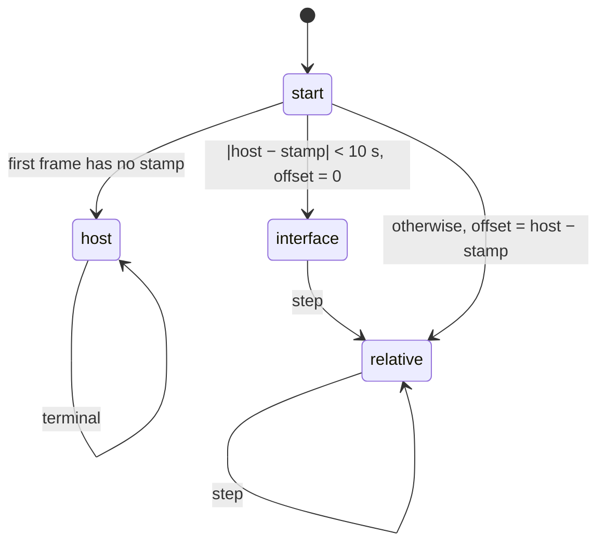

# Timestamps

Every frame arrives with a stamp from the *interface*: the kernel for
SocketCAN, the driver for PCAN/Kvaser/Vector, the edge's `candump` for
ssh-socketcan. **Timestamp Mode** decides how that stamp becomes the trace
time. The trace time is always on this machine's (the host's) timeline.

| Mode | Trace time | Use when |
|---|---|---|
| `host` | when this machine received the frame; the stamp is discarded | the interface clock is untrustworthy and transport delay is small |
| `interface` | the stamp, unchecked | the interface clock is the reference (PTP-synced edge, offline log replay) |
| `relative` | stamp + a constant offset, fixed at the first frame | a boot-relative or unsynced counter whose *rate* you trust |
| `auto` (default) | one of the above, chosen from evidence, re-chosen when the interface clock steps | anything else |

Frames without a stamp use host time in every mode.

## `auto`


```mermaid
stateDiagram-v2
    [*] --> start
    start --> host: first frame has no stamp
    start --> interface: |host − stamp| < 10 s, offset = 0
    start --> relative: otherwise, offset = host − stamp
    interface --> relative: step
    relative --> relative: step
    host --> host: terminal
```

A **step** is declared only after this, per frame in `interface` or `relative`:

```
residual   r = host receive time − (stamp + offset)      delay only ever adds to r

accumulate 30 s of host time (STEP_WINDOW_S): keep min(r) and max(r), then reset.
           No averaging. One on-time frame puts min(r) near 0 and vetoes a
           positive step, so a burst, a reconnect ride-through, or a draining
           backlog can never qualify.

verdict    OFF  if min(r) > +10 s  or  max(r) < −10 s      (STEP_MIN_S)
           OK   otherwise → persistence resets to 0

persist    1st OFF window  → log "interface clock ±N s vs host, pending", count it
           2nd OFF in a row (STEP_PERSIST) with |min₂ − min₁| < 1 s → STEP:
               offset += min₂   (the least-delay sample, either direction) → relative
```

| Constant | Value | Why |
|---|---|---|
| `STEP_MIN_S` | 10 s | below this the interface clock is left alone, at entry and forever after, so a bus on a machine that is a few seconds off stays coherent with that machine's own logs; 3 s of real link delay fooled a 1 s floor in testing; 10 s sustained excess delay is a dead link, not congestion; adapter drift at 50 ppm needs ~55 h to reach it |
| `STEP_AGREE_S` | 1 s | two OFF windows must estimate the same step within this: a plateau, not a ramp still draining |
| `STEP_WINDOW_S` | 30 s | TCP recovery after a delay change was turbulent for ~20 s when measured |
| `STEP_PERSIST` | 2 | a false step needs ≥10 s of constant excess delay, stable to ±1 s, for a full 60 s |

- A real step is corrected 60–90 s after it happens with continuous traffic
  (a window closes on the first frame past 30 s, so a sparse bus takes
  longer). Frames inside the detecting windows keep the old offset; nothing
  is buffered.
- Nothing under 10 s is ever corrected; drift is not slewed.
- Every transition and every OFF window is logged
  (`auto: relative -> interface (re-anchored), offset +0.000 s`,
  `auto: interface clock +120.0 s vs host over 30 s, pending (1/2 windows)`;
  positive means the interface clock reads ahead of the host, so link delay
  shows up negative).
  Bus metrics: `timestamp_state`, `clock_offset_s`, `clock_steps`,
  `clock_deviation_windows`. Watch the last one in the field before touching
  a constant.

## Examples

Host clock is right; one frame per second.

| Interface clock | `auto` does | Trace error |
|---|---|---|
| in sync | `interface` | 0 |
| 5 s ahead from the start | `interface`, verbatim | 5 s, by design: coherent with that machine's logs |
| 2 min ahead from the start | `relative`, offset −120 s | ~first-frame delay |
| in sync, then steps +2 min at t=20 | `interface` → `relative` at t≈80–110 | 120 s for 60–90 s, then 0 |
| 5 min behind (no RTC), NTP fixes it at t=20 | `relative` (+300) → `relative` (≈0) at t≈80–110 | 300 s for 60–90 s, then 0 |
| in sync, then steps +3 s | stays `interface` | 3 s, by design (below `STEP_MIN_S`) |
| stamps missing (vcan over ssh with `-H`) | `host` | transport delay |
| in sync, delivery stalls 5 s then bursts | stays `interface` | 0 (stamps were right) |
| in sync, link adds 3 s of delay for a minute | stays `interface`, 0 OFF windows | 0 (stamps were right; `host` mode would be 3 s late) |
| in sync, link adds 12 s of delay for 45 s | stays `interface`, 0–1 OFF windows logged (window alignment) | 0 |

## Which clock is the interface clock

| Interface | Stamp source | Can step when |
|---|---|---|
| socketcan (Linux) | this machine's kernel at receive | never observable: same clock as the host |
| ssh-socketcan | edge kernel; adapter hardware clock with **Hardware timestamps** on | edge NTP sync; the adapter clock is seeded once at interface open and never follows a later step |
| pcan / kvaser / vector / other | driver: host boot time + adapter counter | adapter drift; boot-time estimate |
